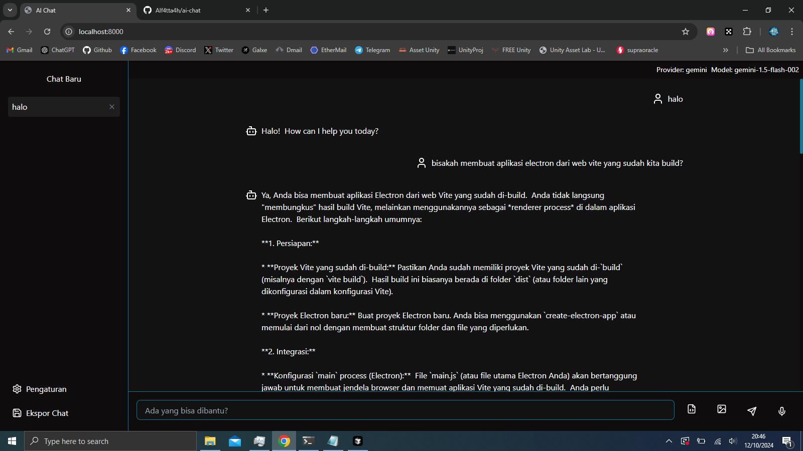

# AI Chat Application

AI Chat Application adalah sebuah aplikasi chat berbasis web yang memungkinkan pengguna untuk berinteraksi dengan berbagai model AI. Aplikasi ini mendukung beberapa penyedia AI seperti Ollama, OpenAI, Claude, dan Gemini.



## Fitur Utama

- Dukungan untuk berbagai penyedia AI (Ollama, OpenAI, Claude, Gemini)
- Antarmuka pengguna yang intuitif dan responsif
- Riwayat chat yang dapat disimpan dan diakses kembali
- Highlighting sintaks untuk berbagai bahasa pemrograman
- Kemampuan untuk mengunggah file dan gambar
- Input suara untuk pesan
- Ekspor chat ke format PDF
- Tema yang dapat disesuaikan

## Teknologi yang Digunakan

- React
- TypeScript
- Vite
- Tailwind CSS
- React Syntax Highlighter
- Lucide React (untuk ikon)

## Cara Menjalankan Aplikasi

1. Pastikan Anda telah menginstal Node.js dan npm di komputer Anda.
2. Clone repositori ini ke komputer lokal Anda.
3. Buka terminal dan navigasikan ke direktori proyek.
4. Jalankan perintah berikut untuk menginstal dependensi:

   ```
   npm install
   ```

5. Setelah instalasi selesai, jalankan aplikasi dengan perintah:

   ```
   npm run dev
   ```

6. Buka browser dan akses `http://localhost:5173` (atau port yang ditampilkan di terminal).

## Konfigurasi

Untuk menggunakan aplikasi ini dengan penyedia AI yang berbeda, Anda perlu mengatur konfigurasi API di menu pengaturan aplikasi. Pastikan Anda memiliki API key yang valid untuk penyedia yang ingin Anda gunakan.

## Kontribusi

Kontribusi untuk proyek ini sangat diterima. Jika Anda ingin berkontribusi, silakan buat pull request atau buka issue untuk diskusi fitur baru atau perbaikan bug.

## Lisensi

[MIT License](LICENSE)

## Kontak

Jika Anda memiliki pertanyaan atau saran, silakan hubungi kami di [rioatmajaya.ch@gmail.com](mailto:rioatmajaya.ch@gmail.com).
