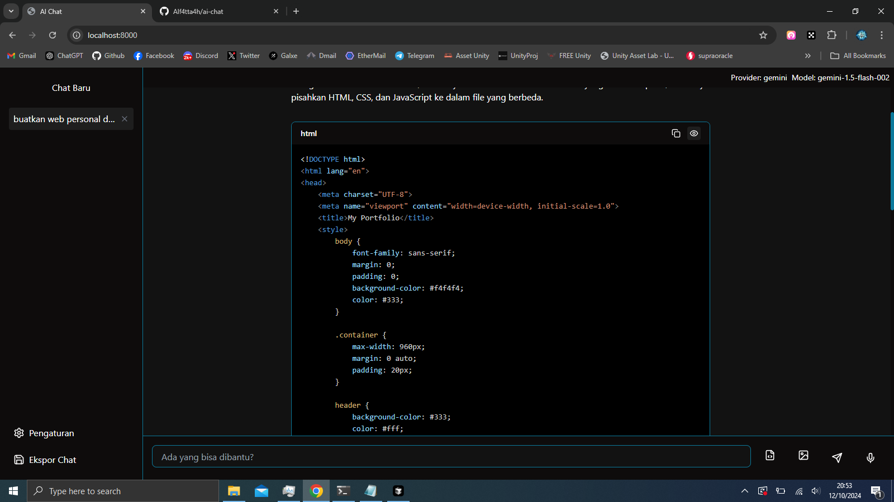
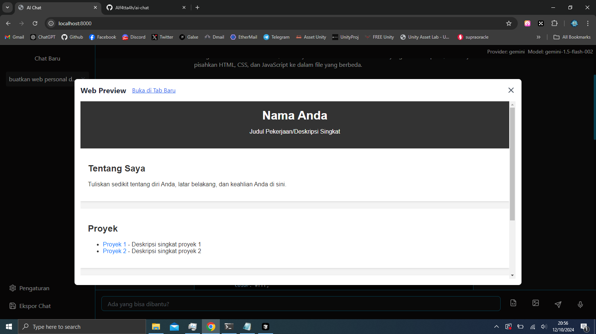

# AI Chat Application

AI Chat Application is a web-based chat application that allows users to interact with various AI models. This application supports several AI providers such as Ollama, OpenAI, Claude, and Gemini.


## Key Features

- Support for various AI providers (Ollama, OpenAI, Claude, Gemini)
- Intuitive and responsive user interface
- Saveable and accessible chat history
- Syntax highlighting for various programming languages
- Ability to upload files and images
- Voice input for messages
- Export chat to PDF format
- Customizable themes
- Web preview for HTML, CSS, and JavaScript code




## Technologies Used

- React
- TypeScript
- Vite
- Tailwind CSS
- React Syntax Highlighter
- Lucide React (for icons)

## How to Run the Application

1. Make sure you have Node.js and npm installed on your computer.
2. Clone this repository to your local machine.
3. Open a terminal and navigate to the project directory.
4. Run the following command to install dependencies:

   ```
   npm install
   ```

5. After installation is complete, run the application with the command:

   ```
   npm run dev
   ```

6. Open a browser and access `http://localhost:5173` (or the port displayed in the terminal).

## Configuration

To use this application with different AI providers, you need to set up the API configuration in the application's settings menu. Make sure you have a valid API key for the provider you want to use.

## Web Preview Feature

This application has a unique feature that allows users to see a live preview of HTML, CSS, and JavaScript code generated by AI. This is very useful for web developers who want to see the results of their code instantly.

How to use the Web Preview feature:
1. Ask the AI to generate HTML, CSS, or JavaScript code.
2. After the code appears, you will see an "Eye" icon next to the code block.
3. Click the icon to open a preview of the code in a new window.
4. The preview will update automatically if you request changes to the code.

## Contributions

Contributions to this project are very welcome. If you want to contribute, please create a pull request or open an issue for discussion of new features or bug fixes.

## License

[MIT License](LICENSE)

## Contact

If you have any questions or suggestions, please contact us at [rioatmajaya.ch@gmail.com](mailto:rioatmajaya.ch@gmail.com).
